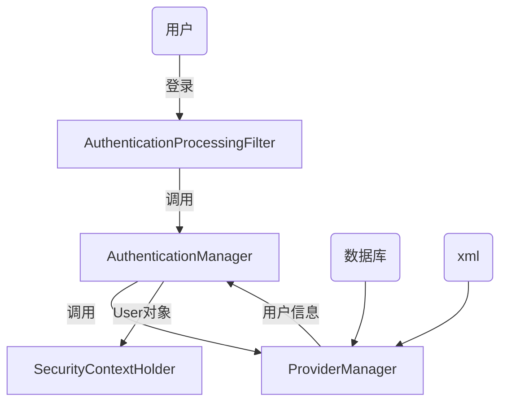
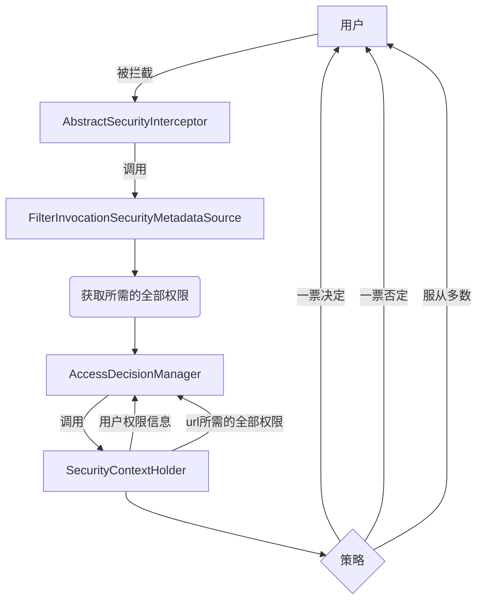

<div style="display:flex;justify-content:center;align-items:center;box-shadow:0 5px 10px rgba(0,0,0,.3);background-image: linear-gradient( 135deg, #81FBB8 10%, #28C76F 100%);">
    <h1 align="center" style="color:#000;border-bottom:none">Spring Security学习笔记</h1>
</div>


> 相关文档

[spring security的原理及教程]:"https://blog.csdn.net/u012367513/article/details/38866465"
[中文文档]:"https://www.docs4dev.com/docs/zh/spring-security/5.1.2.RELEASE/reference"
[徐靖峰Spring Security（一）]:"https://www.cnkirito.moe/spring-security-1/"


> 用户登录



> 授权




# 实现`AccessDeniedHandler`接口但抛出异常不通过该接口

[spring security中配置了AccessDeniedHandler没有生效问题]:"https://blog.csdn.net/shan165310175/article/details/105415249"

原因：

​		使用`@PreAuthorize` 注解然后抛出权限不足异常，是不会被`AccessDeniedHandler`捕获到的，而是会被全局异常被捕获。


# `@PreAuthorize(isAuthenticated())` 匿名用户会被拦截的原因

```java
public final boolean isAuthenticated() {
	return !isAnonymous(); 
}
```

​		`SecurityContextHolder` 的 `isAuthenticated()`方法对匿名用户和非匿名用户都是返回`true`

​		在`@PreAuthorize`，`isAuthenticated()` 实现是对匿名用户返回`false`  