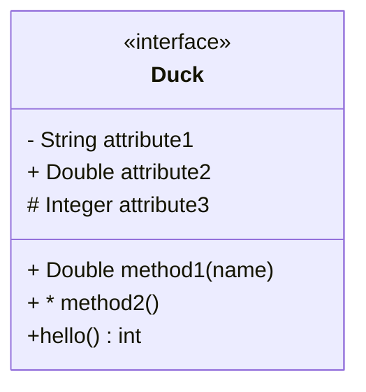
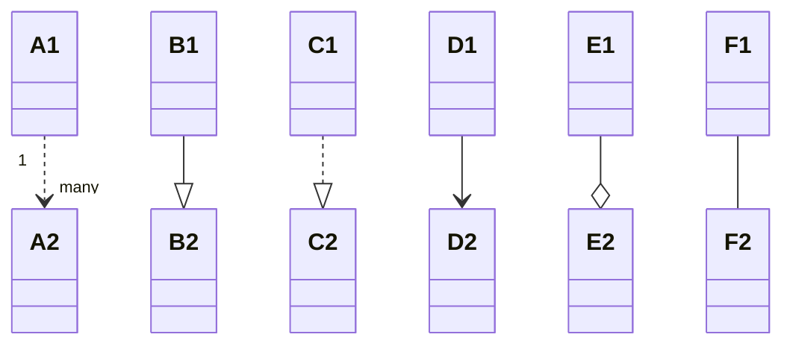
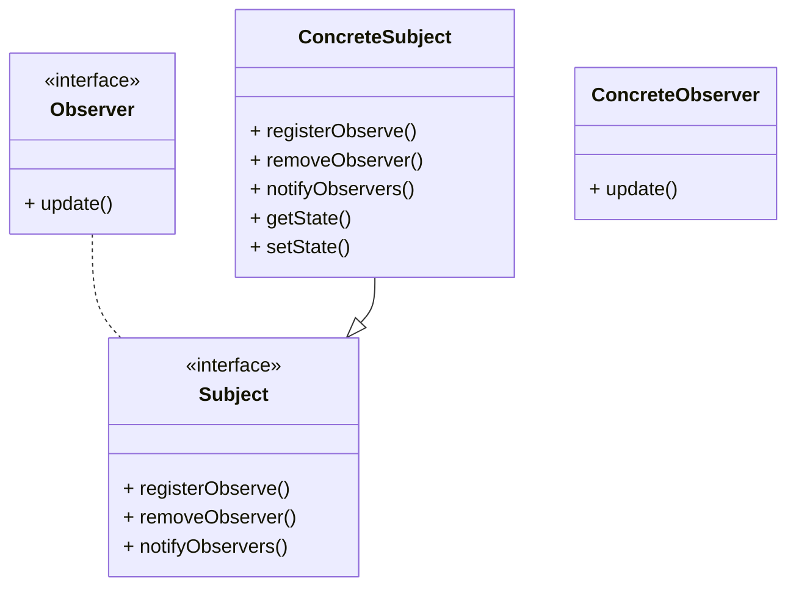

<h1 style="display:flex;justify-content:center;align-items:center;height:100px;color:#fff;background-image: linear-gradient(122deg, #1f28ea, #9030a6, #b44365, #c85817);box-shadow:0 5px 5px rgba(0,0,0,.05);border-radius:10px;">设计模式</h1>

> Markdown中UML图的画法
>
> https://mermaid-js.github.io/mermaid/#/classDiagram

> 类

`-`  私有属性

`+`  类的公共方法

`#`  类的protected方法

对于方法的的表示，括号中可以加入方法的参数，在括号后面可以放上方法的返回值类型

类的类型有：<<interface>>  <<abstract>>  <<enumration>> 

> 类与类间的关系

1. 依赖（Dependency）：元素A的变化会影响元素B，但反之不成立，那么B和A的关系是依赖关系，B依赖A；uml中用带箭头的虚线表示，箭头指向被依赖元素。

   `classK ..> classL : 依赖关系`

2.  泛化（Generalization）：就是通常所说的继承（特殊个体 is kind of 一般个体）关系。uml中用带空心箭头的实线线表示，箭头指向一般个体。

   `classA --|> classB : 继承关系（泛化）`

3.  实现（Realization）：元素A定义一个约定，元素B实现这个约定，则B和A的关系是Realization，B 实现了 A。这个关系最常用于接口。uml中用空心箭头和虚线表示，箭头指向定义约定的元素。

   `classM ..|> classN : 实现关系`

4.  关联（Association）：元素间的结构化关系，是一种弱关系，被关联的元素间通常可以被独立的考虑。uml中用实线表示，箭头指向被依赖元素。

   `classG --> classH : 关联关系`

5.  聚合（Aggregation）：关联关系的一种特例，表示部分和整体（整体 has a 部分）的关系。uml中用带空心菱形头的实线表示，菱形头指向整体。

   `classE --o classF : 聚合关系`

6. 组合（Composition）：组合是聚合关系的变种，表示元素间更强的组合关系。如果是组合关系，如果整体被破坏则个体一定会被破坏。uml中用带实心菱形头的实线表示，菱形头指向整体。

   `classC --* classD : 组合关系`

# 观察者模式

