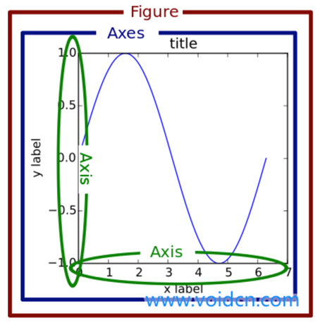
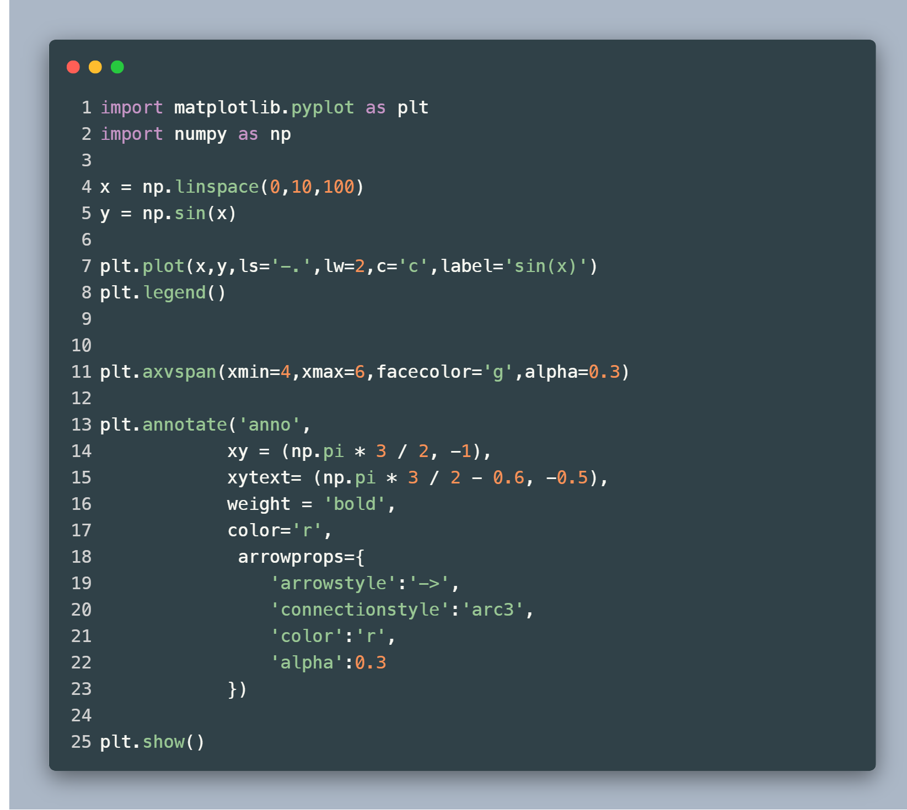
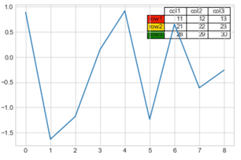
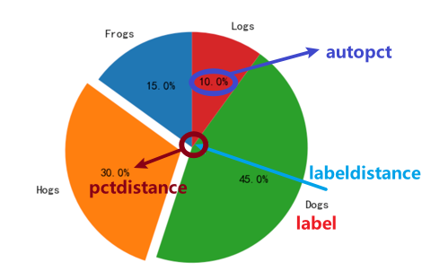
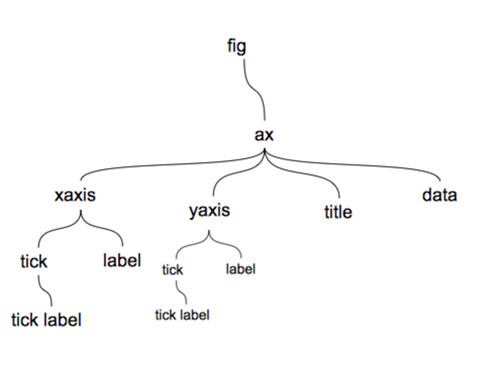
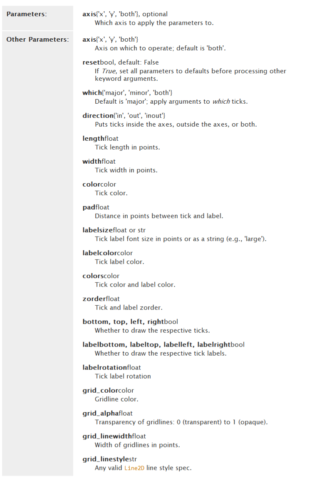

<h1 style="height:120px;display:flex;align-items:center;color:#fff;background-image: linear-gradient( 135deg, #81FBB8 10%, #28C76F 100%);justify-content:center;">Matplotlib笔记</h1>

# 基本用法

> 引入

```python
import matplotlib.pyplot as plt
import numpy as np
```


```python
x = np.linspace(-1,1,50)  // -1到1的50个点
y = 2*x + 1
plt.plot(x,y)
plt.show()
```


> figure图像

```python
//第一个图像
plt.figure()
plt.plot(x,2*x+1)
//第二个图像
plt.figure(num=3,figsize=(8,5))  //可以加参数
plt.plot(x,-2*x+1,color='red',linewidth=10.0,linestyle='--')
//显示
plt.show()
```


> 坐标轴

```python
plt.xlim((-1,2)) //取值范围
plt.ylim((-2,3))
plt.xlabel('I am x label')  //x轴标签
plt.ylbael('I am y label')
plt.yticks([0,60,100],['bad','normal','good'])

```


```python
# gca = 'get current axis'
ax = plt.gca()
# 脊梁
ax.splines['right'].set_color('none')
ax.splines['top'].set_color('none')
ax.xaxis.set_ticks_position('bottom')  #设置底部为x轴
ax.yaxis.set_ticks_position('left') #设置左边为y轴
ax.spines['bottom'].set_position(('data',-1)) #把x轴放在y轴的-1处
ax.spines['left'].set_position(('data'),0) #把y轴放在x轴的0处，'data'可换为outward，axes
```


> legend 图例

```python
plt.legend() #默认的会根据label来设置

# handles = []
# labels = ''
# loc = 'best'   
```


> annotation 注解

```python
x = numpy(0,10,10)
y = 2*x + 1
plt.plot(x,y)

x0 = 1
y0 = 2*x0+1
plt.scatter(x0,y0,s=50,color='b')
plt.plot([x0,y0],[y0,0],'k--',lw=2.5)

#第一种方法
plt.annotate(r'$2x+1=%s$' % y0,xy=(x0,y0),xycoords='data',xytext=(+30,-30),textcoords='offset points',fontsize=16,arrowprops=dict(arrowstyle='->',connectionstyle='arc3,rad=.2'))
# connectionstyle  弧度


#第二种方法
plt.text(1,1,'hello',fontdict={'size':16,'color':'r'})
```


> tick 能见度

```python
for label in ax.get_xticklabels() + ax.get_yticklabels():
    label.set_fontsize(12)
    label.set_bbox(dict(facecolor='white',edgecolor='None',alpha=0.7))
```


> subplot 子图

```python
plt.figure()

# ==========第1种方法==========
plt.subplot(2,2,1) #分为2行2列，第一个位置
plt.plot([0,1],[0,1])

plt.subplot(2,2,2) #分为2行2列，第二个位置
plt.plot([0,1],[0,2])

plt.subplot(223) #分为2行2列，第三个位置
plt.plot([0,1],[0,3])

plt.subplot(224) #分为2行2列，第四个位置
plt.plot([0,1],[0,4])

# ==========第2种方法==========
plt.figure()
ax1 = plt.subplot2grid((3,3),(0,0),colspans=3,rowspan=1)
ax1.plot([1,2],[1,2])
ax1.set_title('ax1')

ax2 = plt.subplot2grid((3,3),(1,0),colspan=2,rowspan=1)
ax1.plot([1,2],[1,2])
ax1.set_title('ax2')

# ==========第3种方法==========
plt.figure()
gs = gridspec.GrdiSpec(3,3)
ax1 = plt.subplot(gs[0,:])
ax2 = plt.subplot(gs[1,:2])
ax3 = plt.subplot(gs[1:,2])
ax4 = plt.subplot(gs[-1,0])
ax5 = plt.subplot(gs[-1,-2])

# ==========第4种方法==========
f,((ax11,ax12),(ax21,ax22)) = plt.subplots(2,2,sharex=True,sharey=True) #sharex共享x轴
ax11.scatter([1,2],[1,2])

```


> 次坐标轴

```python
x = np.arange(0,10,0.1)
y1 = 0.05 * x ** 2
y2 = -1 * y1

fig,ax1 = plt.subplots()
ax2 = ax1.twinx() #共享x轴
ax1.plot(x,y1,'g-')
ax2.plot(x,y2,'b--')

ax1.set_xlabel('X data')
ax1.set_ylabel('Y1',color='g')
ax2.set_ylabel('Y2',color='b')

plt.show()

```


- 


> scatter 散点图

```python
import matplotlib.pyplot as plt
import numpy as np

n = 1024
X = np.random.normal(0,1,n)
Y = np.random.normal(0,1,n)
T = np.arctan2(X,Y) #随机颜色

plt.scatter(X,Y,s=75,c=T,alpha=0.5)

plt.xlim((-1.5,1.5))
plt.ylim((-1.5,1.5))
plt.xticks(())
plt.yticks(())

plt.show()
```


> 柱状图

```python
import matplotlib.pyplot as plt
import numpy as np

n = 12
X = np.arange(n)
Y1 = (1 - X / float(n)) * np.random.uniform(0.5,1.0,n)
Y2 = (1 - X / float(n)) * np.random.uniform(0.5,1.0,n)

plt.bar(X,Y1,facecolor='r',edgecolor='w')
plt.bar(X,-Y2,facecolor='g',edgecolor='w')

for x,y in zip(X,Y1):
    #ha: horizontal aligement
    #va: vehicle aligement
    plt.text(x+0.4,y+0.05,'%.2f' % y,ha='center',va='bottom')
    
for x,y in zip(X,Y2):
    #ha: horizontal aligement
    #va: vehicle aligement
    plt.text(x+0.4,-y-0.05,'%.2f' % y,ha='center',va='top')
    
plt.xlim(-.5,n)
plt.ylim(-1.24,1.25)
plt.xticks(())
plt.yticks(())

plt.show()
```


> 等高线图

```python
def f(x,y):
    # the height function
    return (1-x/2+x**5+y**3) * np.exp(-x**2-y**2)

n = 256
x = np.linspace(-3,3,n)
y = np.linspace(-3,3,n)
X,Y = np.meshgrid(x,y)

plt.contourf(X,Y,f(X,Y),8,alpha=0.75,cmap=plt.cm.hot)
C = plt.contour(X,Y,f(X,Y),8,colors='black',linewidth=.5)
plt.clabel(C,inline=False,fontsize=10)

plt.xticks(())
plt.xticks(())
plt.show()
```


> 图像

```python
a = np.array([0.1,0.2,0.3,
             0.4,0.5,0.6,
             0.7,0.8,0.99]).reshape(3,3)

plt.imshow(a,interpolation='nearest',cmap='bone',origin='upper')
plt.colorbar(shrink=0.9) #压缩右侧颜色条

plt.xticks(())
plt.yticks(())
plt.show()
```





# Numpy

## linspace

在 start -> end 之间生成 count 个数

> Attributes

`start*`  =  Number =>  起始

`end*`  = Number => 结束

`count*`  =   Number =>  生成个数

## random.randn

在标准正态分布中随机取 count 个数

> Attributes

`counts*`  =  Number =>  生成个数


# Matplotlib

## figure

> Attributes

`figsize` 图形的长宽

`dpi` 图像分辨率

`facecolor` 图形背景色

`edgecolor` 边框色

`frameon` Boolean 是否绘制制图外框架


## xlim  ylim

```python
plt.xlim( start , end ) #调整坐标轴的边界为从 start 开始到 end 结束
```


## xlabel  ylabel

```python
plt.xlabel( name ) #修改坐标轴标签
```


## grid  网格线

> attributes

`linestyle`  设置网格的线条类型

`color`  网格的线条颜色


## axhline  axvline参考线

> Attributes

`x`  在x轴的位置

`y`  在y轴的位置


## axvspan  参考区域

> Attributes

`ymin`  `xmin`   在x轴/y轴的起始位置

`ymax`  `xmax`  在x轴/y轴的结束位置


## annotate 注解




## text  无箭头的注解

```python
plt.text( x , y , cont )
#x: 在x轴的位置
#y: 在y轴的位置
#cont: 注解的内容
```


## title  标题

```python
plt.title( cont )
```

> Attribute

`cont*`   =  String =>  标题的内容

`loc`  =  String =>  标题的位置

`family`  =  String =>  

`size`  =  Number =>  字体大小

`style`  =  String =>  斜体/粗体

`color`  = String  =>  字体颜色


## legend  图例

> Attributes

`loc`  图例的位置

- upper left
- upper center
- upper right
- lower left
- lower center
- lower right
- best

`nloc`  =  _  =>  设置图例框中元素的列数

`bbox_to_anchor` = (num1,num2) =>  num1控制左右移动，num2控制上下移动

`fancybox`  =  Boolean =>  是否将图例框的边角设置为圆形 


## table  表格

```python
plt.table(cellText = [[1,1,1],[2,2,2],[3,3,3]],
         colWidths=[0.1]*3,
         rowLabels=['r1','r2','r3'],
         colLabels=['c1','c2','c3'],
         rowColours=['red','green','blue'],
         loc='upper right')
```




## plot 

`plot()`是在`axes`子图对象上绘图，如果当前`figure`对象中没有`axes`对象，则将会创建一个几乎充满整个图表的`axes`对象，并且使此`axes`对象成为当前的`axes`对象


## scatter 散点图

> Attributes

`x`  `y`  = Array => x轴和y轴对应数据

`s`  = Array => 每个点的大小

`c`  = Array => 每个点的颜色

`marker` = String =>  绘制点的类型


## bar  柱状图

```python
# 堆积柱状图
x = [1,2,3]
y1 = [1,2,3]
y2 = [4,5,6]
plt.bar(x,y1)
plt.bar(x,y2,bottom=y1)

# 并列柱状图 偏移一个柱子的宽度
bar_width = 0.35
plt.bar( x , y1 , bar_width )
plt.bar( x+bar_width , y2 , bar_width )
```

> Attributes

`hatch`  柱子的填充形状

`tick-label`  y轴上的柱体标签


## barh  垂直柱状图


## hist  直方图

> Attributes

`x`: 数据

`bin`: 条形个数

`range`: 上下界

`density`: 是否将频数转换成频率

`cumulative`: 是否计算累计频率

`bottom`: 为直方图的每个条形添加基准线,默认为0

`align`: 对齐方式

`rwidth`: 条形的宽度

`color`: 填充色

`edgecolor`: 设置直方图边框色

`label`: 设置直方图标签

`histtype`

- `bar`是传统的条形直方图。 如果给出多个数据，则条形图并排排列。
- `barstacked`是一种条形直方图，其中多个数据相互堆叠。
- `step`生成默认情况下未填充的线图。
- `stepfilled`生成默认情况下已填充的线图。


## pie 饼状图

> Attributes

`labels` 设置相对应数据的标签

`labeldistance`  设置标签距离圆心的距离，labeldistance比例值(值越大离图就越远)

`autopct`  ‘%1.1f%%’:设置饼图上显示数据，(最外面有两个%(转化为百分比),里面1.1f%即保留一位小数加%1.2f即保留两位小数)

`pctdistance` 设置比例文字距离圆心的距离，值越大离圆心就越远

`explode`参数设置每一块顶点距离圆心的长度(比例值)里面的值的数量和数据是相同的数量，不想设置时直接给个0即可，注意用小括号括起来。

`colors` 参数设置每一块的颜色

`shadow` 是否绘制阴影

`startangle` 设置饼图旋转的度数(逆时针旋转)




## polar  极线图

```python
plt.polar( angle , len )
```


## stem  火柴棒图


## boxplot  箱线图

> Attribtues

`x`  =  Array =>  数据

`notch`  =  Boolean =>  中间箱体是否有缺口

`sym`  =  String =>  异常点的形状

`vert`  =  Boolean =>  图形是纵向或横向

`positions` = Array =>  图形位置

`widths`  =  Array  =>  每个箱体的宽度

`labels`  =  Array =>  每个箱体的标签

`meanline`  =  Boolean  =>  是否显示均值线


## errorbar  误差棒图


## Axes

> figure与axes之间的关系



> Methods

`gca()`  get current axes  获取当前的 axes 绘图区域

`gcf()`  get current figure 获取当前的 figure 对象


### 设置轴脊

上下左右的轴脊位置是不变的，x轴和y轴是可变的

```python
ax1 = plt.subplot(111)
ax1.spines['left'].set_color('r')  #设置边框宽度
ax1.spines['left'].set_linewidth(5)  #设置边框线条宽度
ax1.spines['left'].set_linestyle('--')  #设置边框线条形状
ax1.xaxis.set_ticks_position('left') #设置x轴的位置，默认在bottom
ax1.spines['left'].set_position(('data',0.5)) #设置y轴位置在0.5处
```


### 设置刻度

```python
#设置刻度范围
ax.set_xlim(0,5)
```

```python
#设置刻度样式
ax.tick_params(axis='both',color='r',width=5,length=10,)
```

